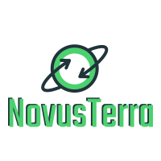

<!--
*** Thanks for checking out this README Template. If you have a suggestion that would
*** make this better, please fork the repo and create a pull request or simply open
*** an issue with the tag "enhancement".
*** Thanks again! Now go create something AMAZING! :D
***
***
***
*** To avoid retyping too much info. Do a search and replace for the following:
*** github_username, repo_name, twitter_handle, email
-->

<!-- PROJECT SHIELDS -->
<!--
*** I'm using markdown "reference style" links for readability.
*** Reference links are enclosed in brackets [ ] instead of parentheses ( ).
*** See the bottom of this document for the declaration of the reference variables
*** for contributors-url, forks-url, etc. This is an optional, concise syntax you may use.
*** https://www.markdownguide.org/basic-syntax/#reference-style-links
-->

[![Contributors][contributors-shield]][contributors-url]
[![Forks][forks-shield]][forks-url]
[![Stargazers][stars-shield]][stars-url]
[![Issues][issues-shield]][issues-url]
[![MIT License][license-shield]][license-url]
[![LinkedIn][linkedin-shield]][linkedin-url]

<!-- PROJECT LOGO -->
<br />
<p align="center">
  <a href="https://github.com/rgoshen/warbler">
    
  </a>

  <h3 align="center">Warbler</h3>

  <p align="center">
    A Twitter Clone
    <br />
    <a href="https://github.com/rgoshen/warbler"><strong>Explore the docs »</strong></a>
    <br />
    <br />
    <a href="https://github.com/rgoshen/warbler">View Demo</a>
    ·
    <a href="https://github.com/rgoshen/warbler/issues">Report Bug</a>
    ·
    <a href="https://github.com/rgoshen/warbler/issues">Request Feature</a>
  </p>
</p>

<!-- TABLE OF CONTENTS -->

## Table of Contents

- [Table of Contents](#table-of-contents)
- [About The Project](#about-the-project)
  - [Built With](#built-with)
- [Getting Started](#getting-started)
  - [Prerequisites](#prerequisites)
  - [Installation](#installation)
- [Usage](#usage)
- [Roadmap](#roadmap)
- [Contributing](#contributing)
- [License](#license)
- [Contact](#contact)
- [Acknowledgements](#acknowledgements)

<!-- ABOUT THE PROJECT -->

## About The Project

[![Product Name Screen Shot][product-screenshot]](https://example.com)

### Built With

- [Bootstrap](https://getbootstrap.com/)
- [Flask](https://flask.palletsprojects.com/en/2.0.x/)
- [Python](https://www.python.org/)

<!-- GETTING STARTED -->

## Getting Started

To get a local copy up and running follow these simple steps.

### Prerequisites

- pip3

```sh
pip3 install -r requirements.txt
```

### Installation

1. Clone the repo

```sh
git clone https://github.com/rgoshen/warbler.git
```

2. Create a python virtual environment and invoke the environment

```sh
python -m venv venv
source venv/bin/activate
pyenv local 3.7.2
```

3. Install packages

```sh
pip3 install -r requirements.txt
```

4. Run the flask server and open browser to localhost

```sh
flask run
```

<!-- USAGE EXAMPLES -->

## Usage

Use this space to show useful examples of how a project can be used. Additional screenshots, code examples and demos work well in this space. You may also link to more resources.

_For more examples, please refer to the [Documentation](https://example.com)_

<!-- ROADMAP -->

## Roadmap

See the [open issues](https://github.com/rgoshen/warbler/issues) for a list of proposed features (and known issues).

<!-- CONTRIBUTING -->

## Contributing

Contributions are what make the open source community such an amazing place to be learn, inspire, and create. Any contributions you make are **greatly appreciated**.

1. Fork the Project
2. Create your Feature Branch (`git checkout -b feature/AmazingFeature`)
3. Commit your Changes (`git commit -m 'Add some AmazingFeature'`)
4. Push to the Branch (`git push origin feature/AmazingFeature`)
5. Open a Pull Request

<!-- LICENSE -->

## License

Distributed under the MIT License. See `LICENSE` for more information.

<!-- CONTACT -->

## Contact

Your Name - [@RickGoshen](https://twitter.com/RickGoshen) - rick.goshen@gmail.com

Project Link: [https://github.com/rgoshen/warbler](https://github.com/rgoshen/warbler)

<!-- ACKNOWLEDGEMENTS -->

## Acknowledgements

- []()
- []()
- []()

<!-- MARKDOWN LINKS & IMAGES -->
<!-- https://www.markdownguide.org/basic-syntax/#reference-style-links -->

[contributors-shield]: https://img.shields.io/github/contributors/rgoshen/repo.svg?style=flat-square
[contributors-url]: https://github.com/rgoshen/warbler/graphs/contributors
[forks-shield]: https://img.shields.io/github/forks/rgoshen/repo.svg?style=flat-square
[forks-url]: https://github.com/rgoshen/warbler/network/members
[stars-shield]: https://img.shields.io/github/stars/rgoshen/repo.svg?style=flat-square
[stars-url]: https://github.com/rgoshen/warbler/stargazers
[issues-shield]: https://img.shields.io/github/issues/rgoshen/repo.svg?style=flat-square
[issues-url]: https://github.com/rgoshen/warbler/issues
[license-shield]: https://img.shields.io/github/license/rgoshen/repo.svg?style=flat-square
[license-url]: https://github.com/rgoshen/warbler/blob/master/LICENSE.txt
[linkedin-shield]: https://img.shields.io/badge/-LinkedIn-black.svg?style=flat-square&logo=linkedin&colorB=555
[linkedin-url]: https://linkedin.com/in/rickgoshen
[product-screenshot]: images/screenshot.png
